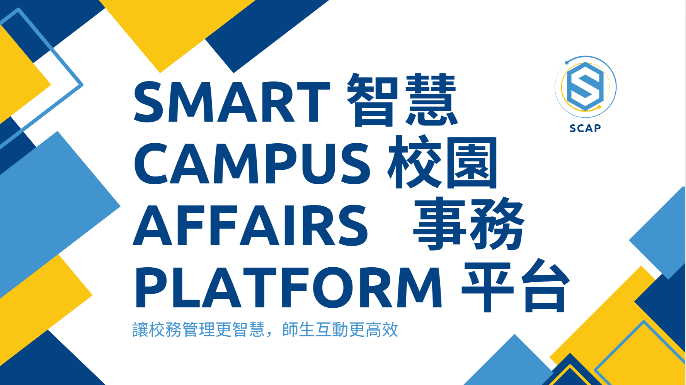

# SCAP - 智慧校園事務平台 (Smart Campus Affairs Platform)

讓校務管理更智慧，師生互動更高效 🚀

---

## 📖 專題介紹
SCAP（Smart Campus Affairs Platform）是一套整合校務管理的智慧平台，旨在解決傳統校務系統資訊分散、管理效率低落的問題。我們透過模組化設計，讓教師、行政人員、家長及學生能共用一個平台，提升行政效能並推動教育數位轉型。
前端頁面(須配合使用)[EAMS1 前端VUE專案]https://github.com/HOYOWOQQ/EAMS-VUE
---

## 🔎 背景問題
- 資料散落各處，人工管理效率低
- 缺乏即時出缺勤與成績回饋機制
- 欠缺整合系統，教務與行政負擔沉重
- 缺乏智慧輔導與自動化統計支援

---

## 💡 開發動機
- 建立模組化、可擴充的學生管理平台
- 協助教師處理日常管理流程數位化
- 提升資料安全與角色權限控管能力
- 整合學習、財務與行政溝通需求於單一平台

---

## 🎯 預期目標
- 推動校務資訊一站式整合：實現跨部門流程自動串接，讓教師、行政、家長、學生共享平台
- 強化數據決策力：設計儀表板，協助學校即時掌握關鍵指標與經營趨勢
- 打造高彈性、可擴充的平台：支援動態調整、模組開關、API 串接，應對校內外新需求
- 預留 AI 輔助與學習分析空間：支持選課建議、學習預警、課程推薦等智慧功能

---

## 🛠 使用技術
- **前端**：Vue.js, HTML5, CSS3, JavaScript, Vite
- **後端**：Spring Boot, Java, RESTful API, JWT, OAuth2
- **資料庫**：Microsoft SQL Server
- **工具**：Git, GitHub, SourceTree, Eclipse
- **部署/測試**：Vercel, Ngrok, MailHog, Cloudflare
- **第三方整合**：綠界金流 (ECPay)

---

## 📂 功能模組
- **會員管理**（巫志原）  
  JWT 登入驗證、Gmail 信箱驗證、權限控制、後台 CRUD、條件查詢
- **課程管理與系統管理**（張碩淮）  
  課程管理、學生報名、排課系統、用戶操作日誌、網站部屬
- **成績管理**（呂哲威）  
  成績自動排名、批次新增、題庫組卷、線上測驗、自動批改
- **費用管理**（黃俐媛）  
  學費通知單、錢包管理、第三方金流整合、繳費/退費查詢
- **出缺勤系統**（李巧吟）  
  出缺勤查詢、教師點名、請假管理、數據統計
- **通知/聊天室**（賴政睿）  
  班級通知、留言板、即時聊天室（支援檔案上傳）、一鍵發送訊息

---

## 🚀 專案執行
### 環境需求
- JDK 17+
- SQL Server 2019+
- Node.js 18+

---
###👥 專案成員

巫志原 – 會員管理模組 ｜ ✉️ wcy.alan.tw@gmail.com

張碩淮 – 課程管理模組 & 系統管理 ｜ ✉️ stanshy666@gmail.com

黃俐媛 – 費用管理模組 ｜ ✉️ xjeo795@gmail.com

李巧吟 – 出缺勤系統 ｜ ✉️ liyun960722@gmail.com

呂哲威 – 成績管理模組 ｜ ✉️ qqbook03@gmail.com

賴政睿 – 通知與聊天室 ｜ ✉️ z047831@gmail.com

---

## 📑 專題簡報(點擊圖片下載)

